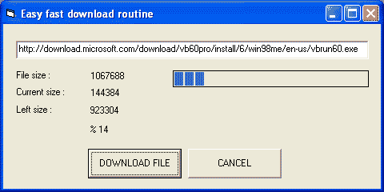



## Easy Fast Internet Download \[No complex routine\. Very easy, progress and lef size, percentage\.\.\.\)

### Description

No complex but powerfull code.

How can i download file via inet control ?

File size, Lef size, percentage, progress, very fast and not complex. Only 30 lines !!!!! Not problem...
 
### More Info
 

             |
---                |---
**Submitted On**   |2007-01-18 22:50:02
**By**             |[B\.Cem HANER](https://github.com/Planet-Source-Code/PSCIndex/blob/master/ByAuthor/b-cem-haner.md)
**Level**          |Intermediate
**User Rating**    |4.6 (32 globes from 7 users)
**Compatibility**  |VB 5\.0, VB 6\.0
**Category**       |[Internet/ HTML](https://github.com/Planet-Source-Code/PSCIndex/blob/master/ByCategory/internet-html__1-34.md)
**World**          |[Visual Basic](https://github.com/Planet-Source-Code/PSCIndex/blob/master/ByWorld/visual-basic.md)
**Archive File**   |[Easy\_Fast\_2043281182007\.zip](https://github.com/Planet-Source-Code/b-cem-haner-easy-fast-internet-download-no-complex-routine-very-easy-progress-and-lef-size__1-67669/archive/master.zip)

